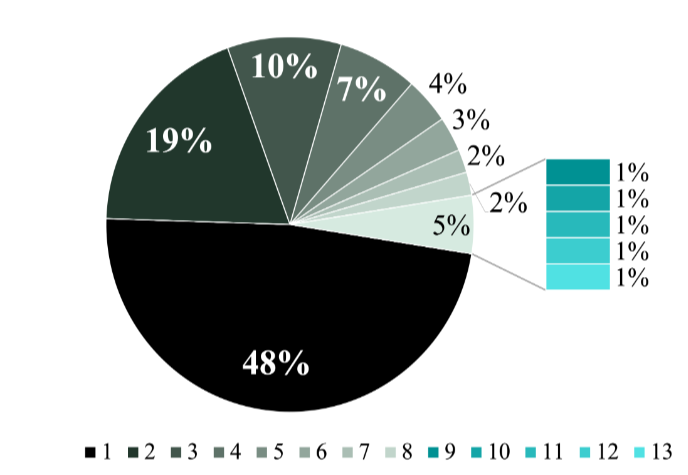
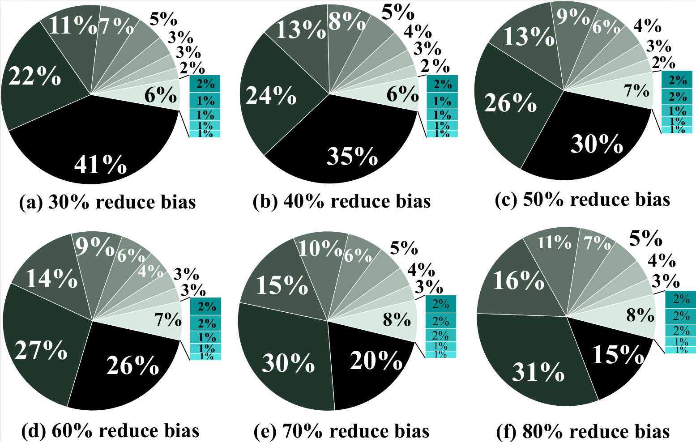

# MultiPoseSeg:
Multi Person Pose &amp; Instance Segmentation

# Model Architecture:

# Data Preparation:
COCO contains highest bias where only one individual exist in a picture as shown in Figure 1. We perform 30% random data reduction in first iteration and 10% on next 5 iterations on bias class and store the result file on each iteration, Figure 2 shows the bias reduction on each iteration.


<p>
    
</p>
<p>
    <em>Figure 1: Unbalanced portions of different number of individuals(1 to 13) in COCO dataset where single-person accounts 48%whereas multi-person more than 5 accounts only 1%</em>
</p>

<p>
    
</p>
<p>
    <em>Figure 2: Bias  reduction  in  COCO  data  set  for  model  trainingto focus on crowded and challenging scenarios. We start from30%(a) reduction in bias and with increase of 10% we reducebias 40%(b) in the next iteration and so on upto 80%(f)</em>
</p>

### Reduce Bias Datasets are avilable in COCO formate:


- [COCO datset with 30% reduce bias](https://drive.google.com/file/d/1EZBL-zyH_qgtXDjJUcIKdBO1bqOdZjUp/view?usp=sharing)
- [COCO datset with 40% reduce bias](https://drive.google.com/file/d/1TM1NQpjzdChppZVS9qBUTLr5HZtYHPgj/view?usp=sharing)
- [COCO datset with 50% reduce bias](https://drive.google.com/file/d/14FXjLsmW56BK0k23uQy3ZjC9vy_aXXjV/view?usp=sharing)
- [COCO datset with 60% reduce bias](https://drive.google.com/file/d/1f5CrRHeJVPeFO2Sgf8hCV2qMPritG-AS/view?usp=sharing)
- [COCO datset with 70% reduce bias](https://drive.google.com/file/d/15WixdsWEfH-UfRkcODowwhuekKKqwF7f/view?usp=sharing)
- [COCO datset with 80% reduce bias](https://drive.google.com/file/d/1q6ejDRVkEFurP89nFNq0gxtwRWKzawwd/view?usp=sharing)
# Environmental Setup:

```
- python==3.6
- conda install -c conda-forge matplotlib==2.0.2
- conda install -c conda-forge opencv OR pip install opencv-python
- conda install -c conda-forge pycocotools
- conda install -c anaconda scikit-image
- conda install tensorflow-gpu==1.13.1
```

**Recomendation:** tensorflow 1.13 & coda 10.

# Download data:

### COCO 2017:

- [COCO 2017 Train images 118K/18GB](http://images.cocodataset.org/zips/train2017.zip)
- [COCO 2017 Val images 5K/1GB](http://images.cocodataset.org/zips/val2017.zip)
- [COCOPersons Train Annotation (person_keypoints_train2017_pose2seg.json) [166MB]](https://github.com/liruilong940607/Pose2Seg/releases/download/data/person_keypoints_train2017_pose2seg.json)
- [COCOPersons Val Annotation (person_keypoints_val2017_pose2seg.json) [7MB]](https://github.com/liruilong940607/Pose2Seg/releases/download/data/person_keypoints_val2017_pose2seg.json)

#### Hint: 

Person keypoint dataset is a subset of COCO2017 dataset ([COCO 2017 Train images 118K/18GB](http://images.cocodataset.org/annotations/annotations_trainval2017.zip)). We train our model only on human instances key points and segmentation by introducing a multi task system. 


# Setup data:

The `coco2017` folder should be like this:
``` 
├── coco2017
│   ├── annotations  
│   │   ├── person_keypoints_train2017.json 
│   │   ├── person_keypoints_val2017.json 
│   ├── train2017  
│   │   ├── ####.jpg  
│   ├── val2017  
│   │   ├── ####.jpg  

```

# Train:

 Run the `python train.py` for training the model. 

#### Note:

1. Please correctly give the path to the `dataset folder` and `check point files` in the `config.py` file. 
2. Currently we only support single-gpu training (Recommended: TITAN RTX).

# Test:

Please lookout the `PosePlusSeg_Test` folder for testing the model. 

# Visualize Results:

#### Human Pose Estimation:


#### Human Instance Segmentation:


#### Joint Human Pose Estimation and Instance Segmentation:


